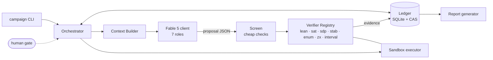
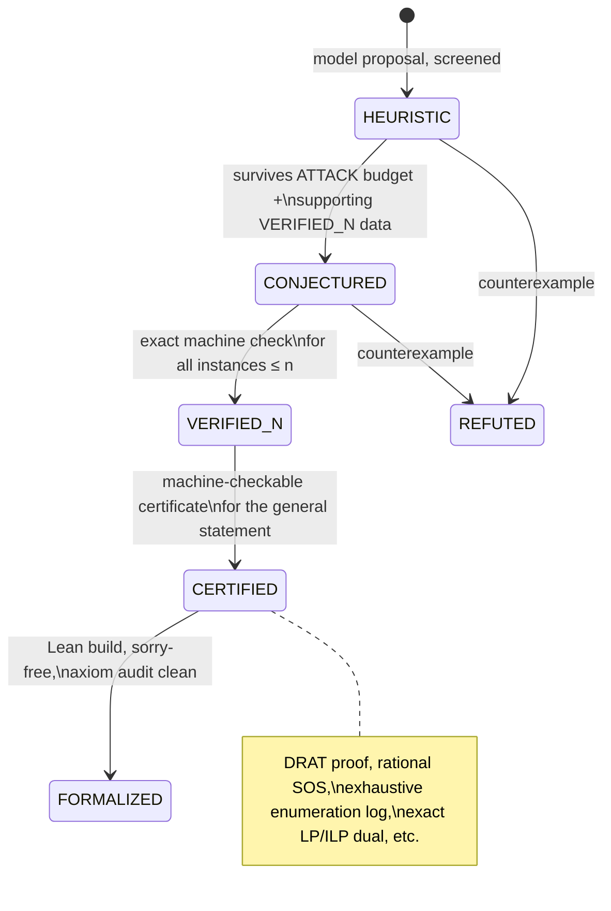
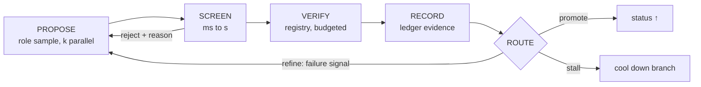
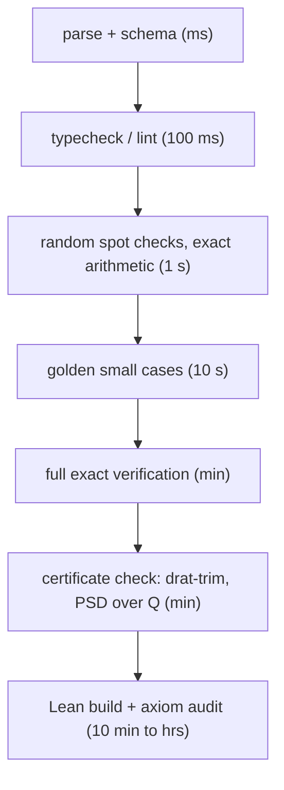

# Empiricist: A Lightweight Fable 5 Harness for the FT-FBQC Open Problems

**Design document, v0.1. June 9, 2026.**
Companion to *Ten Open Problems in Fault-Tolerant Fusion-Based Quantum Computation* (the "problems document"). Working name after the GSV; rename at will.

---

## 0. Definition of done

Work backwards from the deliverable. A campaign against Problems P1 to P10 succeeds when it produces **ledger entries at status `CERTIFIED` or `FORMALIZED`**, each backed by a machine-checkable artifact, plus an auto-generated status report that a referee could audit without trusting a single line of model output. Everything else in this document is scaffolding for that.

The success metric is **status promotions per token**, not transcript quality. A run that burns 10M tokens and produces one exact value of $F(G)$ for a new lattice family beat a run that produced a beautiful 40-page unverified "proof."

Constraints that define *lightweight*:

- One Python process, one repo. State is SQLite plus a content-addressed file store. No queues, no vector DB, no services.
- Solvers and provers are subprocesses (SAT, SDP, Lean, simulators). The harness never links them; it shells out and parses.
- Fable 5 (`claude-fable-5`) is the only model, played in different roles via system prompts and thinking budgets.
- v0 in one engineer-week. Resumable from the ledger alone: kill the process at any point, restart, nothing is lost but an in-flight sample.
- The model never has a shell. It proposes; the harness executes in a sandbox.

---

## 1. Failure modes this design exists to kill

Every structural choice below traces to one of five known failure modes of LLM-driven mathematics.

| # | Failure mode | Mechanism that kills it |
|---|---|---|
| F1 | **Model as oracle.** Confident, wrong claims enter downstream context and compound. | Nothing enters the ledger above `HEURISTIC` without machine evidence. The model's opinion of its own output is worth zero status. |
| F2 | **Context rot.** Long sessions accumulate stale, contradictory, or hallucinated state. | Fresh context per attempt. The ledger, not the transcript, is memory. Prompts are rebuilt from verified artifacts plus one failure signal. |
| F3 | **Verifier gaming.** Search overfits to bugs in the scoring code. | Verifiers are themselves certified against golden suites before use; load-bearing verifiers get two independent implementations. |
| F4 | **Proof by intimidation.** Fluent natural-language proofs with a buried gap. | Prover output is a lemma DAG, each lemma separately attackable. Independent Critic instance with a bounty framing. Promotion past `PROVED_DRAFT` requires a certificate or Lean. |
| F5 | **Unbounded burn.** Tokens sink into a stalled branch. | Per-move budget caps, stall detection on ledger events, and a scheduler that reallocates toward problems that are promoting. |

---

## 2. Architecture



Seven components, one paragraph each.

**Orchestrator.** A single async loop: pick the next `(problem, move)` from the scheduler, build context, sample the model, screen, verify, record, route. Around 500 lines. All state transitions go through the ledger; the orchestrator holds nothing in memory that matters.

**Ledger.** SQLite tables (`artifacts`, `evidence`, `edges`, `runs`) plus a content-addressed store (blake3-named files) for artifact bodies, verifier logs, datasets, and Lean modules. Append-only in spirit: statuses change only by adding evidence rows. Schema in Appendix A. The ledger is the system of record, the checkpoint format, the resumption state, and the source for the final report. Git-friendly: the CAS diffs cleanly.

**Context Builder.** Deterministically assembles a prompt from: the frozen problem statement (the P1..P10 specs from the problems document, loaded as root artifacts), the minimal set of `VERIFIED`-or-better dependencies for the current move, the last failure signal (verifier log excerpt, compiler error, counterexample), and the role card. Nothing else. The frozen prefix is stable by construction, which makes prompt caching effective (Section 5).

**Fable 5 client.** Thin wrapper over the Messages API. Roles are system-prompt plus sampling-config bundles, versioned in the repo. Outputs are structured JSON artifacts (statement, construction, code, proof DAG), parsed and hashed before anything else happens.

**Screen.** Millisecond-to-second rejection: does the JSON parse, does proposed code typecheck, does a claimed identity hold at three random points, does a proposed construction pass a 10-second exact spot check. Screening exists to protect verifier compute, not to accept anything.

**Verifier Registry.** The trust boundary. Pluggable verifiers behind one protocol (Appendix B), each pinned by version and certified against a golden suite before it can produce ledger evidence. Section 6.

**Sandbox executor.** Subprocess jail (resource limits, no network, temp filesystem) for running Toolwright-written code, enumerations, and solver invocations. Every execution logs command, seed, versions, and wall time into `runs`.

---

## 3. The epistemic ledger

Every artifact carries exactly one status. The lattice, with what each promotion requires:



Definitions, precisely:

- **`REFUTED`**: a machine-verified counterexample exists. Terminal, but kept: refuted conjectures are training signal and prompt material for repairs.
- **`HEURISTIC`**: model output that passed screening. Default status for everything the model says. Never cited in prompts as fact.
- **`CONJECTURED`**: a precise statement that survived a budgeted counterexample search (`ATTACK`) and is consistent with a `VERIFIED_N` dataset. Conjectures record the falsification effort spent.
- **`VERIFIED_N`**: exactly machine-checked for all instances up to size `n` (or a stated finite set). Datasets, tables, and small-case theorems live here. `n` is a field, not a footnote.
- **`PROVED_DRAFT`** (sub-status of `CONJECTURED`): a natural-language lemma-DAG proof exists and the Critic returned no gap at a stated effort level. Deliberately capped: human review or a certificate is required to go higher. This is where F4 dies.
- **`CERTIFIED`**: the general statement has a machine-checkable certificate independent of the model: a DRAT-checked UNSAT proof, an exact rational SOS/PSD decomposition, a logged exhaustive enumeration with a verified tail bound, an exact ILP dual, a Peierls counting object with interval-arithmetic tail.
- **`FORMALIZED`**: a Lean 4 module builds sorry-free against pinned mathlib and passes an axiom audit (`#print axioms` shows only the standard set).

Two rules with teeth. First, **provenance is total**: artifact IDs are content hashes; evidence rows pin verifier name and version; sampler seeds and config hashes live in `runs`; a campaign is replayable. Second, **external claims are quarantined**: anything the Prospector role asserts about the literature is tagged `EXTERNAL` and never used as a mathematical dependency; it routes to the human gate.

---

## 4. The core loop

The inner loop is a generate-verify-refine cycle. It runs unattended.



**Screening cascade.** Verification cost spans nine orders of magnitude, so gates are ordered by cost and every gate can reject:



A healthy `SEARCH` wave loses 60 to 90 percent of samples in the first three gates for pennies. Anything that reaches gate E is worth the compute.

**Context discipline** (the F2 killer): each `PROPOSE` gets a fresh context built as `[frozen spec] + [role card] + [minimal verified deps] + [last failure signal] + [output schema]`. Transcripts are archived to the CAS for audit and then never re-entered into prompts. Refinement means re-proposing against a failure signal, not continuing a conversation.

**Two loops.** The inner loop above is machine-only and runs at seconds-to-minutes cadence. The outer campaign loop runs at hours-to-days cadence and is human-gated at exactly four points: `REDUCE` (reformulating a problem statement), promotion of a `CONJECTURED` statement to a proof campaign, acceptance of `PROVED_DRAFT` lemmas as worth formalizing, and anything leaving the repo.

---

## 5. Fable 5 usage: roles and API mechanics

One model, seven roles. A role is a system prompt, a thinking budget, a sampling config, and an output schema.

| Role | Thinking | Sampling | Purpose | Output |
|---|---|---|---|---|
| Prospector | medium | 1 sample | literature framing, prior-art checks | `EXTERNAL`-tagged claims with sources |
| Toolwright | high | 1 to 2 | write verifiers, enumerators, encoders, with tests | code + test suite artifact |
| Searcher | low | k = 16 to 64, high diversity | constructions, gadgets, program mutations | candidate objects (canonical form) |
| Conjecturer | medium | 4 to 8 | pattern-mine `VERIFIED_N` datasets | precise statements + predicted values |
| Prover | maximum | 1 | lemma-DAG proofs against frozen statements | structured proof (DAG of lemmas) |
| Critic | maximum | 2 independent | find the gap | line-anchored gap, or bounded no-gap attestation |
| Formalizer | high | iterative | Lean statement, then proof, against compiler feedback | Lean module |

Mechanics that matter:

- **Prompt caching.** The frozen spec plus role card is a stable prefix; cache it. `SEARCH` waves then price at roughly output-token cost, which is what makes k = 64 sampling economical.
- **Parallel sampling with canonical dedupe.** Searcher outputs are canonicalized (graph canonical form via nauty, circuit normal form via PyZX) before scoring, so the population does not fill with relabelings.
- **Thinking budgets are role policy.** Prover and Critic get maximum extended thinking; Searcher explicitly does not (diversity beats depth in the propose step; the verifier supplies the depth).
- **Structured outputs.** Every role emits JSON matching a schema in the repo; the parser is the first screen gate.
- **Critic protocol.** Fresh instance, no access to the Prover transcript, sees only the lemma DAG. System prompt frames a bounty: the Critic's only win condition is a concrete, line-anchored gap or counterexample; "looks fine" costs it. Two independent Critic samples; disagreement escalates to the human gate.
- **No agentic shell.** Tool execution is harness-mediated. This costs a little latency and buys reproducibility (every execution is a `runs` row) and containment.
- **Batch mode.** Overnight `SEARCH` and `ATTACK` waves go through the batch API at reduced cost; interactive loops (Formalizer against the Lean compiler) stay synchronous.

---

## 6. Verifier registry

The registry is the trust boundary, so it gets the most engineering care per line.

| Verifier | Backend | Certifies | Used by |
|---|---|---|---|
| `lean` | Lean 4 + pinned mathlib, `lake build`, axiom audit | `FORMALIZED` | all |
| `sat` | kissat / CaDiCaL with DRAT logging, checked by `drat-trim` | UNSAT claims, finite case analyses | P5, P9 |
| `smt` | Z3 / cvc5 (proof objects where supported) | algebraic identities, small QF checks | P3, P6 |
| `ilp` | HiGHS, exact rational re-check of the optimal basis | extremal bounds | P5, P8 |
| `sdp-rational` | numerical SDP, then rational rounding + exact LDLᵀ PSD check over ℚ (SymPy / python-flint) | SOS dual certificates as exact upper bounds | P3, P4 |
| `stab-fusion` | exact stabilizer engine: graph states, LC orbits, Type-II fusion rule; stim for circuits | fusion-network and graph-state claims | P1, P2, P5, P10 |
| `enum` | orbit-aware exhaustive enumeration, nauty canonical forms, logged counts | `VERIFIED_N` datasets, lattice-animal counts | P1, P2, P5, P8 |
| `interval` | mpmath / python-flint (arb) interval arithmetic | analytic tail bounds, threshold inequalities | P1, P2, P4 |
| `zx` | PyZX semantic equality (tensor contraction on small diagrams), web/detecting-region checker (to build) | rewrite soundness, fault-distance on instances | P6, P7, P10 |
| `eqp` | twee (equational prover) driving Knuth-Bendix completion attempts | confluence critical-pair analyses | P6 |
| `mc-screen` | Monte Carlo (stim) | **screening only**; never produces status evidence | P1, P4, P8 |

**Verifier certification** (the F3 killer). A verifier cannot emit ledger evidence until it holds a certification stamp: its golden suite passes, and the stamp records suite hash and verifier version. Golden suites come from published ground truth: the Löbl et al. 8-qubit minimum-fusion table for `stab-fusion` and `enum`; known exact results ($p^*(0)=1/2$, 2D erasure threshold $=1/2$, $F(\text{path}_N)=N-3$ style identities) as spot goldens; textbook SOS decompositions for `sdp-rational`. Load-bearing verifiers (`stab-fusion`, `enum`) get **two independent implementations** (different author-roles, different data structures) and evidence requires agreement. Mutation testing on the golden suite catches suites that are too weak to certify anything.

Toolwright-written code enters the registry only through this gate. The model writes verifiers; it never certifies them.

---

## 7. Moves and per-problem playbooks

Ten primitive moves compose into playbooks:

`REDUCE` (reformulate; human-gated) · `BUILD_TOOL` (Toolwright; exits via certification) · `ENUMERATE` (certified exhaustive computation) · `SEARCH` (k-parallel propose-screen-score; ledger keeps the Pareto set) · `CONJECTURE` (pattern-mine datasets; auto-`ATTACK` before acceptance) · `ATTACK` (budgeted counterexample search against a statement) · `PROVE` (lemma-DAG draft) · `CRITIQUE` (independent gap search) · `FORMALIZE` (Lean, compiler-in-the-loop) · `REPORT` (auto-generated from ledger).

Routing matrix (● primary, ○ supporting):

| Problem | ENUM | SEARCH | CONJ | SDP/SOS | SAT/#SAT | EQP | PROVE | FORMALIZE |
|---|---|---|---|---|---|---|---|---|
| P1 threshold theorem | ● | ○ | | | ○ | | ● | ○ |
| P2 erasure = percolation | ● | | ○ | | ○ | | ● | ○ |
| P3 $p^*(k)$ optimality | ○ | ○ | | ● | | | ○ | ● |
| P4 loss frontier $\lambda^*(n)$ | ○ | ● | ○ | ● | | | ○ | |
| P5 fusion cost $F(G)$ | ● | ● | ● | | ● | | ● | ● |
| P6 ZX proof complexity | | ● | ○ | | ○ | ● | ○ | ● |
| P7 ZX FT theorem | ○ | ● | ● | | | | ● | ○ |
| P8 constant-overhead FBQC | ● | ● | ○ | | | | ○ | ○ |
| P9 rigorous $10^{-2}$ | ● | ○ | | | ● | | ● | ● |
| P10 distillation-free | ○ | ● | ○ | | | | ○ | |

Playbooks, one block each. *First milestone* is the first ledger promotion worth having; campaigns that cannot reach it cheaply get cooled down.

**P5, minimum-fusion synthesis (the pilot).** `BUILD_TOOL` the fusion engine and LC-orbit machinery, certified against the published 8-qubit table (golden data already exists: rare luxury). `ENUMERATE` $F(G)$ in the GHZ₃ model to $N = 9, 10$ via orbit-aware DP. `CONJECTURE` closed forms for paths, cycles, trees, $L \times L$ grids; auto-`ATTACK` each. `PROVE`/`CRITIQUE` the survivors by induction. `FORMALIZE` the $F(G) \ge N-3$ counting bound as the harness's first Lean artifact. `SEARCH` for an NP-hardness gadget. *First milestone:* a `VERIFIED_N` dataset past the published frontier. *Escalation:* hardness reduction campaign.

**P3, boosted-fusion optimality.** `BUILD_TOOL` the symbolic unambiguity constraint generator (detection amplitudes as matrix permanents in interferometer entries). `SDP/SOS` relaxations of the discrimination problem for fixed small $(k, m)$; rational rounding; exact PSD check. *First milestone:* a `CERTIFIED` upper bound $p^*(1) \le 1/2 + \epsilon$ at small $m$, i.e., the first rigorous statement beyond the polarization-preserving class. Then `PROVE` the mode-bound lemma (iv), which converts small-$m$ certificates into statements about $p^*(k)$ proper. Formalization target: the rational certificates.

**P1 and P2, threshold theorem and erasure thresholds (shared spine).** `BUILD_TOOL` the explicit FN₆ syndrome complex encoding once; it is a shared artifact for P1, P2, and P4. `ENUMERATE` connected fault clusters and lattice animals with certified counts; `interval` for tails. Assemble the Peierls object for P1(i) in the Prover/Critic loop with every counting lemma machine-checked. *First milestone (P1):* a `CERTIFIED` correctable point, even a weak one such as $(0.005, 0, 0.0005)$; push toward $(0.04, 0, 0.003)$ by optimizing the cluster decomposition (a `SEARCH` problem over proof parameters). *First milestone (P2):* certified $a \le T_E \le b$ with $b - a \le 0.05$; tighten from there.

**P9, rigorous $10^{-2}$ threshold.** The big-compute campaign, deliberately after the pilot. `BUILD_TOOL` the extended-rectangle fault model compiler (circuit gadget to CNF). `#SAT`-style malignant-set counting with symmetry breaking, DRAT-logged. `SEARCH` over gadget designs (ancilla verification variants) scored by the certified count. `FORMALIZE` the counting-to-threshold glue in Lean; the enumeration enters as a checked certificate. *First milestone:* reproduce the AGP-era count for one exRec end-to-end with a machine-checked certificate. That alone modernizes a 2006-vintage computation.

**P6, ZX rewriting.** `eqp` (twee) completion runs on equational presentations of stabilizer ZX; `zx` (PyZX) as semantic oracle for candidate rules. `SEARCH` for short derivations at scale (upper-bound evidence for (i)) and for candidate hard families. *First milestone:* a machine-checked critical-pair analysis of a proposed confluent stabilizer subsystem, in either direction (completion or a certified obstruction).

**P7, ZX fault-tolerance theorem.** Counterexamples first: `SEARCH` small $(\Delta, w, r)$-bounded diagram families and machine-check thresholds and fault distances on instances (`zx` + `stab-fusion`), trying to break the conjectured statement before proving it. Statement repairs are cheap; proof campaigns are not. *First milestone:* either a `REFUTED` row forcing a repair, or a `VERIFIED_N` sweep of instances supporting the matchable case, feeding a P1-style counting proof.

**P4, loss frontier.** Upper bounds: `SDP` certificates on finite fusion gadgets (recoverable information at loss $\eta$). Lower bounds: `SEARCH` over encoded-fusion families scored only by certified analyses, reusing the P1/P2 spine. *First milestone:* any `CERTIFIED` $\lambda^*(n) \le 1/2 - f(n)$ for a finite $n$, which would be the first nontrivial finite-size upper bound in the literature.

**P8, constant-overhead FBQC.** `SEARCH` over product-code constructions and fusion layouts scored by exact $\mathbb{F}_2$ parameters (rate, distance bounds, check weight) plus interval-certified expansion. *First milestone:* a `CERTIFIED` family with the right parameters and an erasure-threshold proof on expander syndrome graphs (spectral percolation bounds, friendlier than P2's Euclidean case).

**P10, distillation-free universality.** `SEARCH` small non-stabilizer resource-state gadgets, validated by exact small-distance simulation (`stab-fusion` extended with a magic register; quimb/statevector below distance 5). Everything here is `VERIFIED_N` evidence-gathering that feeds P7(iii); no proof campaign until that language exists. *First milestone:* a gadget whose detecting structure demonstrably covers a non-Clifford fault class at $d = 3, 5$.

Shared infrastructure to build once: the FN₆ complex encoder (P1, P2, P4), the rational-SOS pipeline (P3, P4), the Lean counting library (P9, then P1, P2), and the PyZX-plus-Pauli-webs tooling (P6, P7, P10).

---

## 8. Scheduling and budgets

Keep v0 dumb. Every move template carries a token cap and a verifier wall-clock cap. A branch **stalls** when it produces no status-changing ledger event within its budget; stalled branches cool down (their scheduler weight halves). The campaign scheduler starts as weighted round-robin over `(problem, move)` pairs; if and when it matters, upgrade to a bandit on *promotion events per token*, which is the only score that resists Goodharting because promotions require certificates. Checkpointing is free: the ledger is the checkpoint.

Suggested v0 defaults: Searcher waves 200k tokens per wave; Prover attempts 400k thinking-inclusive per lemma; Critic 200k per review; Formalizer 1M per lemma across compiler iterations; verifier wall-clock 10 min (screen tier) and 12 h (certificate tier). Tune from the ledger's `runs` table, which is also the cost dashboard.

---

## 9. Human gates and integration

Four gates, all cheap to operate from the report: approve `REDUCE` reformulations; select which `CONJECTURED` statements get proof campaigns; accept `PROVED_DRAFT` lemma DAGs as formalization-worthy; release anything externally. Everything else runs unattended.

Integration notes, all optional: Empiricist is a library plus CLI and runs standalone. It slots naturally as a skill inside a deep-gvr style loop (the inner cycle here *is* generate-verify-refine with a hard verifier); long-horizon campaigns can run under an agent runtime such as Skaffen with the ledger as the shared substrate; ledger events serialize cleanly onto a Parallax-style discourse channel if multi-agent review is ever wanted; and the Prospector role can point at ArXHive or the raw arXiv API for retrieval. None of these are dependencies.

---

## 10. Build plan

**v0, one week, pilot on P5.**

- Days 1 to 2: ledger + CAS + CLI skeleton; Fable 5 client with role cards; `stab-fusion` verifier with the Löbl golden suite; certification command.
- Day 3: `ENUMERATE` the GHZ₃ fusion-cost table to $N = 9$ (10 if the orbit DP is kind). First `VERIFIED_N` artifact past the published frontier.
- Day 4: `CONJECTURE` + auto-`ATTACK` over families (paths, cycles, trees, grids); ledger fills with `CONJECTURED` and `REFUTED` rows.
- Day 5: `PROVE`/`CRITIQUE` one surviving family; `FORMALIZE` the $N-3$ bound in Lean. First `FORMALIZED` artifact.

Exit criteria for v0: at least one `FORMALIZED`, one `VERIFIED_N` dataset beyond the literature, three surviving conjectures, and a report generated purely from the ledger.

**v0.2:** the rational-SOS pipeline and a first P3 certificate; the FN₆ complex encoder shared by P1/P2. **v1:** the P9 campaign (exRec compiler, #SAT counting, Lean glue), which is the compute-heavy flagship and reuses everything above.

**Anti-scope**, to keep "lightweight" honest: no distributed execution, no vector database, no fine-tuning or RL loop, no web UI beyond the generated report, no multi-agent architecture beyond the Prover/Critic pair, no autonomous literature claims (Prospector output is quarantined by construction).

---

## Appendix A. Ledger schema

```sql
CREATE TABLE artifacts (
  id           TEXT PRIMARY KEY,   -- blake3 of canonical content
  kind         TEXT,               -- statement|dataset|construction|certificate|proof_dag|lean|verifier|report
  problem      TEXT,               -- P1..P10 | shared
  title        TEXT,
  content_path TEXT,               -- CAS pointer
  status       TEXT,               -- REFUTED|HEURISTIC|CONJECTURED|VERIFIED_N|CERTIFIED|FORMALIZED
  status_n     INTEGER,            -- populated iff VERIFIED_N
  created_at   TEXT,
  run_id       TEXT
);
CREATE TABLE evidence (
  artifact_id      TEXT,
  verifier         TEXT,
  verifier_version TEXT,
  verdict          TEXT,           -- PASS|FAIL|ERROR|TIMEOUT
  log_path         TEXT,
  wall_s           REAL,
  created_at       TEXT
);
CREATE TABLE edges (src TEXT, dst TEXT, rel TEXT);
  -- rel: depends_on | refutes | generalizes | formalizes | golden_for
CREATE TABLE runs (
  run_id TEXT PRIMARY KEY, move TEXT, role TEXT, model TEXT,
  tokens_in INT, tokens_out INT, thinking_tokens INT,
  seed INT, config_hash TEXT, started TEXT, ended TEXT
);
```

## Appendix B. Verifier protocol

```python
class Verdict(StrEnum):
    PASS = "PASS"; FAIL = "FAIL"; ERROR = "ERROR"; TIMEOUT = "TIMEOUT"

@dataclass(frozen=True)
class Evidence:
    verdict: Verdict
    log_path: Path
    details: dict          # counterexample, certificate hash, counts, ...

class Verifier(Protocol):
    name: str
    version: str
    def applicable(self, artifact: Artifact) -> bool: ...
    def verify(self, artifact: Artifact, budget: Budget) -> Evidence: ...

# Registry rule: verify() may be called only if a certification stamp
# (golden suite hash, version, PASS) exists in the ledger for (name, version).
```

## Appendix C. Playbook example (P5, YAML)

```yaml
problem: P5
spec: artifacts/P5_statement            # frozen; from the problems document
shared: [stab_fusion, enum, lean]
moves:
  - move: BUILD_TOOL
    target: fusion_engine
    golden: datasets/loebl_8q_table     # certification suite
  - move: ENUMERATE
    tool: fusion_engine
    range: {N: [9, 10]}
    emits: VERIFIED_N
  - move: CONJECTURE
    inputs: [dataset:F_table]
    families: [path, cycle, tree, grid]
    auto_attack: {budget_tokens: 100k, budget_wall: 30m}
  - move: PROVE
    gate: human                          # pick which conjecture
    output: proof_dag
    then: CRITIQUE {samples: 2, fresh_context: true}
  - move: FORMALIZE
    target: lower_bound_N_minus_3
    lean: {mathlib: pinned, axiom_audit: true}
budgets: {searcher_wave: 200k, prover_lemma: 400k, formalizer_lemma: 1M}
stall: {no_promotion_tokens: 2M, action: cooldown}
```

## Appendix D. Critic role card (skeleton)

```
You are the Critic. You receive a lemma DAG for a claimed proof.
You do not know who wrote it and you have no stake in it being correct.

Your only success condition is finding a concrete defect:
  - a lemma whose statement is false (give a counterexample), or
  - an inferential gap (name the lemma, the line, and the missing step), or
  - a definition mismatch against the frozen problem statement.

"Looks correct" is a failure state for you unless you have checked every
edge of the DAG; in that case emit NO_GAP_FOUND with effort_level and the
list of edges checked. Never propose fixes. Never restate the proof.
Output schema: critic_report.json.
```

---

*This document specifies v0.1. The correct amount of harness is the minimum that makes F1 through F5 structurally impossible; resist adding more.*
